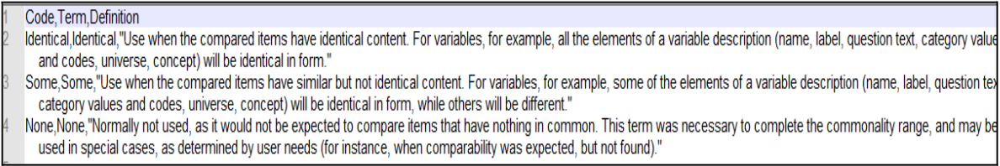

# {{ page.title }}

Codes need to be in csv format. Instructions for preparing DDI and
CESSDA vocabularies for import from Excel to csv:

1\. Open a new Excel spreadsheet, copy and paste the code values, terms
and descriptions from the existing Excel format of the CV, using
'Paste special' and selecting Unicode text (UTF-8).

2\. Add a new row at the top of the file and add suitable text in each
of the three columns to create column headers (e.g. 'Code value' in
column A, 'Term' in column B and 'Description' in column C). Your
Excel file should now look like this:

3\. Check the descriptions. If there are any words with quotation
marks around them like "street" in the image above), replace the
quotation marks with ' ('street').

4\. Save the Excel in CSV (comma delimited) format.

5\. Open the CSV file in Notepad++, Oxygen or another text editor
where you can see how it displays. Check that you do not have any
information apart from the column headers in the first row (see
the above image). Code values, terms and definitions need to be separated by a
comma, so if other characters such as semi-colons (;) have been used,
they will need to be replaced with commas (,). If needed, convert
encoding to UTF-8 (note that some basic text editors do not have the
option to convert the encoding). Check that description texts have
quotation marks before and after them. Add any that are missing, and
save.

6\. In the CESSDA Vocabulary Service, click on the button 'Import codes from CSV'.
Browse to select the file. The file name will 'flash' and disappear.
Close the window. You should now see a list of codes to be copied. If
not copied, check that you have the quotation marks in right places
and no slashes (/) within definitions.

7\. Click on 'Import codes'. Browse and select the CSV file. You will
see a table displaying the codes to be added. Now either click on
'Import codes', or cancel.

Note that the import only brings in code-level information, all else
needs to be added manually.
