# {{ page.title }}

## Creating and publishing a new source language CV

To create a new vocabulary you need to have SL admin rights in an agency.
A Service Owner can create an agency, add the agency link, agency logo and URIs to the agency information.
The maximum size for the logo provided is 2MB, and the recommended resolution is width 240 pixels and height 75 pixels.

Sign in (top right hand corner) and select 'Editor' from the top menu.
All actions that you can perform are presented as a series of buttons
in the list down the left hand side of the screen (depending on your
user role, these may vary).

- 'Add CV' allows you to start a new CV from scratch.

- If you click on one of the listed CVs, you will see 'CV actions'
  that allow you to make changes to the vocabulary as a whole,
  including options to add a new CV, add a translation,
  create a new version and delete a version of the vocabulary or the whole vocabulary.

For now, Choose 'Add CV'.

A new draft with a version number 1.0 DRAFT is created. You can edit
this draft using the editing buttons.

There are several mandatory fields to complete, marked with a red
asterisk.

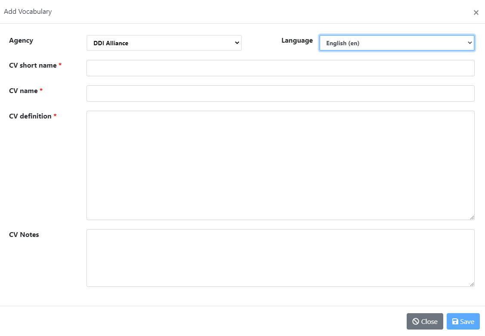

### Agency

Choose your Agency from the drop-down list. The agency you can choose depends on your
rights and role. If the Agency you require is not available you will
need to discuss the possibility to add it with the Content Administrator,
that is, the Service Owner of the CESSDA Vocabulary Service.

### Language (source)

Choose the source language; for both CESSDA and DDI CVs, this is
English. Other languages are available in the drop-down list.
The Vocabulary Service may also be used for in-house thesauri.

### CV short name (code)

This is a machine-actionable field. Add the short name (Code) for the
CV. If you are entering a CV
that has already been published elsewhere, the same short name used
elsewhere should be used here. If you try to enter a short name
that already exists within the Vocabulary Service, the system will prevent you from
saving it.

The short name can be based on the human readable vocabulary name.
For instance, the short name of Mode of Collection vocabulary would be ‘ModeOfCollection’.
It is formed by putting the words together and starting each word with an upper case character.
The system only allows alphanumeric characters, as well as '+' '-' ':' characters.
Using abbreviations is not recommended.

Please check the short name carefully before saving in case of errors.
**Important: read the code naming rules carefully first and take care
to ensure that code is correct from the start**. As this code is one of the
IDs for the vocabulary, **it is no longer possible to edit it once it
has been saved**.

If you do make an error in the CV short name code, you should proceed as
follows:

If the CV is unpublished:

1\) Delete the SL vocabulary (if unpublished)

2\) Create a new CV with the corrected short name.

If the CV has already been published:

1\) Produce and save an export/download of the vocabulary in its
current state, including all language versions, for reference.

2\) Delete the CV. This will delete all versions of it and all other
language versions that have been created.

3\) Create a new CV with the corrected short name, copy pasting from
the saved file. Ensure that you enter the same version number and
version information as shown in your download. It is not possible to
bring earlier versions back to the system. You need to send the saved
file to translators and ask them to copy and paste their translation.
There is no copying functionality available yet, so it
is best **not** to make an error in the short name code, as recreating
the CV will mean a lot of manual copying. You can access the deleted
CV in the Editor.

### CV name (human-readable title of the CV)

Next, add a name for the CV.

### CV definition

Add a definition that describes the vocabulary. Now click on Save to
save the CV. Note: You will not be able to save the entry if the CV
already exists, i.e. the CV short names are identical.

### CV notes

These are notes that apply to the whole vocabulary. For example,
information that this vocabulary is to be used with quantitative data
only. The notes entered here can later be edited in the Editor by the
SL Admin, without having to change the version of the CV. Notes do not
therefore affect versioning.

## Adding codes and editing your new, not-yet-published CV

There are now several actions you can take.

You can make changes to the vocabulary level fields you have already added by using the ‘Edit SL en’ button (en=English).
If you close the pop-up without saving,  no changes will be made.

You can choose to delete your whole draft CV at any point before
publication. Click on 'Delete CV.' **Be careful with Delete CV; since
this is the first ever version of the vocabulary, the whole CV will be
erased. If needed, save a download/export of the draft CV in your
files before deleting.** Clicking on 'Cancel' in the deleting pop-up
will retain the CV.

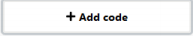

'Add code' allows you to add codes (terms) within the CV. The system
adds the new code to the end of the vocabulary. Complete the 'Code
value' field, add the
descriptive term and definition, and click Save. If you like to see
the code on one line in the Details tab, you can extend column length
by dragging on the line.

Code values are created in the SL and are the same across languages,
this way they function as identifiers for the codes.
DDI Alliance and CESSDA use code values based on human readable descriptive terms.
However, this has the consequence that if a descriptive term changes, the code value is changed as well.
This makes the code values less useful and  persistent as identifiers.
It is recommended for other agencies to use ‘meaningless’ code values that do not need to be changed, e.g. GUIDs.
Code value changes should be extremely rare.
The system requires code values to be alphanumeric, but '+' '-' ':' are accepted as well.

Guidelines for creating code values for DDI Alliance and CESSDA:

A code value is a single word or a concatenation of several words.

- Each word starts with an upper case character.
- Only alphanumeric characters are allowed, as well as: '+' '-' ':'
- No slashes (/) are allowed in the code value: they should be replaced with ‘Or’, e.g. EventOrProcess,
  or left out altogether, if it seems a better alternative.
- No abbreviations are allowed. Only a few exceptions are allowed in the case of acknowledged abbreviation code lists,
  such as the two-letter ISO code for the US.

Code values should be not too long, to ensure readability.
There is no hard rule, but it is reasonable to use no more than 5 words and 50 characters.
If spaces are added within a code, the system will automatically remove them.

The code value is just a code value, and its purpose is to be machine-actionable.
Search interfaces should search on the list of captions (descriptive terms) and/or definitions i.e. the human-readable part.

## Creating a hierarchy

CVs can be hierarchical. First, add the new code using the 'Add code'.
Then ‘Move code’ action can be used to create a hierarchy.

**Note that in the code value element only the value for the
individual term is to be entered in the code pop-up; the hierarchy in
the code (i.e. broader term code value) is automatically added by the
system when the user uses the functionality ‘Move code’.**

Using 'Move code': Click on the code in the table in the Details tab, and
choose 'Move code' from the action buttons. In the moving pop-up,
click on the code you want to move the other code next to and select
from the blue action buttons whether you want the other code to come
before or after or as a child.

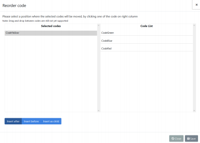

If you want to move *CodeYellow* to be the child of *CodeGreen*, click
on *CodeGreen* in the list on the right and select 'Insert as child'.
Now you see in the Code List the change made, with hierarchy
introduced into the code and can save.

If you now want *CodeRed* to be another child of *CodeGreen* but to
be placed above *CodeYellow*, click on *CodeRed* in the Details tab
table, and select 'Move code' from the actions. In the moving pop-up,
click on *CodeGreen.CodeYellow* and select 'Insert before' as the
action. You can now see *CodeRed* in its right place as a child
above *CodeYellow*. Remember to save.

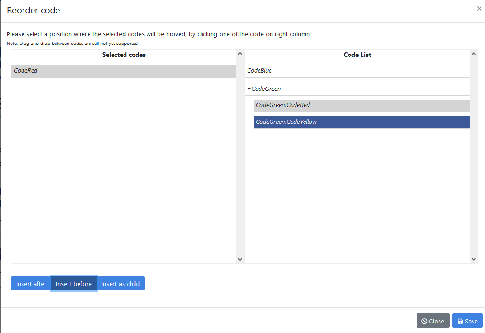

Dragging is no longer possible in this
version of the software since it caused various problems. Note: Codes
can only be ordered within the SL - this is not an option for
translations.

## Editing codes

All edit buttons for a code will appear when you click on a code in
the table. Term-level values of the code are editable, unlike the
CV-level Short Name (see the CV Short Name section above).
Descriptive terms and definitions can be edited as well.

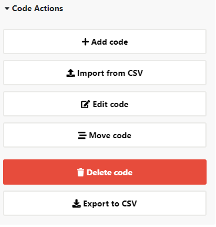

The rest of the items can now be added to the CV.

Note that deleting a parent code (broader term) deletes the children
as well. If you want to keep the children, use 'Move code' pop-up to
insert them before or after another broader code first. You can
rearrange the hierarchy later.

If entering codes from an already existing controlled vocabulary, you
can enter the codes by using the 'Import codes from CSV' functionality
(see [Import codes from CSV section](import-from-csv.html) for step by step details of how to do this).
This is quite complicated, so contact the Service Owner first.

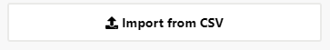

## Reviewing the CV

Once all the codes have been added, ordered and any changes have been
made the CV is ready to be reviewed. You can download your draft vocabulary in PDF or HTML
format in the ‘Export/Download’ tab  and ask others to review it.
When the vocabulary has been reviewed, change the status to 'Review'.

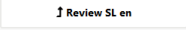

The screen will display the vocabulary as it is after all changes
made. However, in 'Review' status, changes can still be made to all
parts of the CV.

Once the CV is finalised, the vocabulary can be published. Only the
Source Language Administrator (Admin_SL) has the right to publish and
has the 'Publish' button.

It is important to review all information before publication,
including proofing all text, adding usage for vocabularies and
checking the licence is correct. Double-check that the version number
is correct. If this is a new controlled vocabulary that has never been
published anywhere before, the version is 1.0. If it is already
published elsewhere but new to the Vocabulary Service, the current version
number of the controlled vocabulary should be added, whatever it is.

You can save your changes before publishing. Once the vocabulary is
ready to publish, click on the Publish SL button.

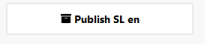

Publishing allows this version of the CV to be viewed by all.
Now translations can be added to this published CV, or a new version of
the published CV can be created.

See [Usage tab](usage-tab.html) and [Licence and citation tab](licence-citation-tab.html)
for information about the usage, copyright and licensing of CVs.

## Creating a new version of a SL CV

Once a CV has been published the SL cannot be edited; only
translations can be added. To update the SL of a published CV, you
need to create a new version. See [Versioning section](versioning.html) for
details on whether this will be a major or minor version of the CV.

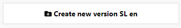

Choose 'Create new version' from the left hand side action. The pop-up
window shows the current version information, if this is a third
version or later. Here you can start internal discussion notes for the
new version. If any discussion notes have been inherited from the
previous version and are no longer needed, you can delete them.

The version will have now changed to (DRAFT).

You now have choices as before:

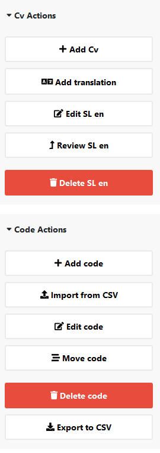

You can make changes to the CV-level information using the 'Edit SL
en' button. CV Notes can be edited at any time by using the 'Add
notes' or 'Edit notes' buttons, before or after publication, without
this affecting the versioning.

When you make changes you will also need to include a reason for the
change, selected from the drop-down list:

- CV name changed

- CV short name changed

- CV definition amended with meaning change

- CV definition rephrased

**Only one change can be made at a time - select the change type and
save.** If you need to make more CV-level changes, open 'edit SL'
again and make the next change, select the change type and save.
As the system only allows users to enter one change type at a time, it is
only possible to record all by making the changes separately.
The change logs needed for producing the version history in the publication pop-up will then include everything.
If you accidentally made more than one change at a time, enter one
change type and make a note for yourself to add the other change
manually later to version change information.

Note: If you add or delete a code, the system records this change
automatically to the version changes.

Change information is needed for versioning and for letting users know
what has changed. There is also an option to describe the changes you
have made in more detail in the description field of change notes in
the pop-up.

'Edit code' allows you to update the information about that code. When
you do this you will need to add a reason for the change (Type) from
the drop-down list before you can save. Make only one change at a
time and choose a change type carefully, it cannot be changed
afterwards. Your change choices are:

- Code value changed

- Code descriptive term rephrased

- Code definition amended with meaning change

- Code definition rephrased

There is also a non-mandatory field, 'Description', where you can add
any other information about the changes made, if needed, such as the
reason for the amendments.

**You can cancel at any time and no changes will be made. Remember to
save if you have made changes. Take care to check that you have the
correct change type before saving.**

If you have accidentally made more than one change at a time,
introduce one appropriate change type and make a careful manual note
to yourself of the other changes made. You need to add them manually in the
publishing pop-up later.

When everything is ready, click on Publish.

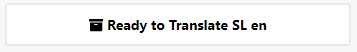

At the publish pop-up you can see the changes between this version and
the previous one.

Finalise 'Version changes' field manually by adding any missing
information, for example, in which codes the changes have taken place.
You can see this information when you click on the *Show comparison with
previous version* section or from the change logs.
Verify from the comparison and change logs that all the changes have been documented to version changes and none are duplicated.
Now you can also correct any errors in change type as this field is editable.

Free-text descriptions added to each change are shown by the system at
the top. Consider whether to add them to version notes. You can
manually edit version notes.

Check that all changes that have been made are documented according to
the rules of the DDI Alliance (CESSDA follows the same rules),
detailed on the controlled vocabularies web page under the versioning
policy:
[DDI Alliance Controlled Vocabularies](http://www.ddialliance.org/controlled-vocabularies).

Check version number (see [Versioning section](versioning.html)),
updating it if necessary. The 'Versions' tab will have details of all
changes to the version visible for users.

It is possible to add or edit information in version notes and version
changes in the Versions tab after publication, so you can correct
mistakes made in version information after publication in the Editor without this
affecting the version number.

## Deleting a SL CV version or the whole vocabulary

Deleting a version: You can delete the new version of the CV when the
status is DRAFT or REVIEW. Click on 'Delete version' and choose
'Delete SL CV and TLs v. x.x.' Please note that this action does not
change the status of the CV to the previous status (e.g. from REVIEW
to DRAFT) but drops the whole version, returning to the previous
version of the CV. There is no way to change status back once the
version is dropped. Returning to the previous status is never possible
in the system. **Take care not to choose 'Delete CV' as this will
erase the whole vocabulary and all its translations.**

Deleting the whole CV: This will erase the whole vocabulary and all
its translations. Do not do this without consulting the TL admins.
When you delete a CV from the system, **the same CV short name cannot
be reused for a new CV**. The system prevents this and only a
technical administrator can change this.
