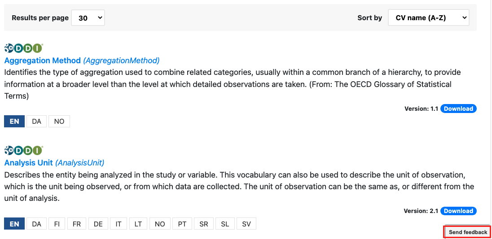
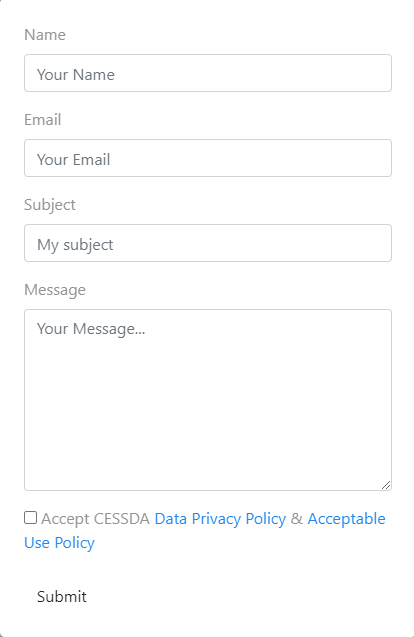

# {{ page.title }}

Any problems with the service can be reported by clicking the ‘Send feedback’
button at the bottom right and filling in the online form.

Enter your name and email address and in the Subject line shortly describe your issue
(e.g. bug, improvement, new feature etc.).
Give us as much details about your issue or suggestion for a new feature or improvement in the Message box.
Tick the box “Accept CESSDA Data Privacy Policy & Acceptable Use Policy” and submit.
We will get back to you as soon as possible.
We are asking for your details just to be able to get back to you.

