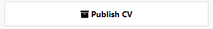
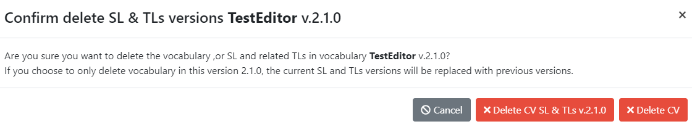
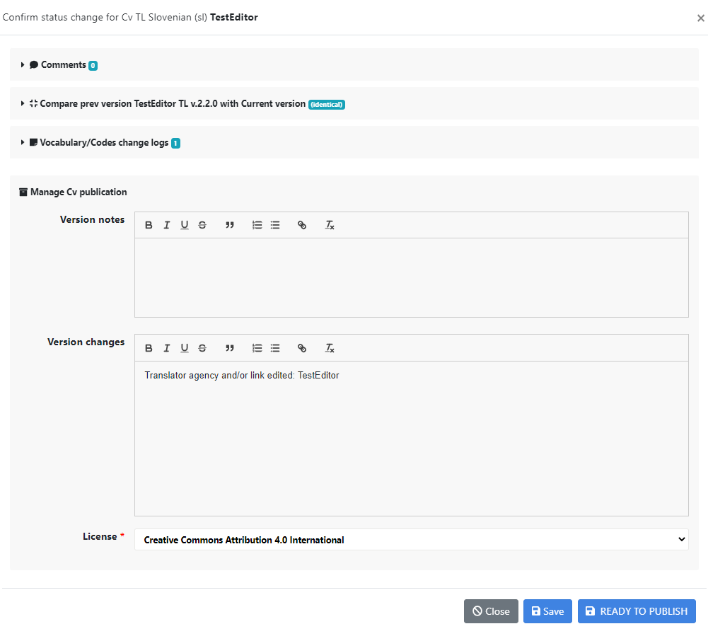
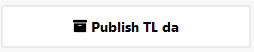

# {{ page.title }}

Before starting any translation, make sure you read through the
translation guidelines below.

## Translation guidelines

### Vocabulary names

CV names should be translated.

CV short names, on the other hand, are machine-actionable and remain
the same across the languages. They are thus not translated. This
ensures interoperability across systems. The CESSDA vocabulary tool
does not allow translation of the short names.

### Vocabulary descriptions

CV definitions should be translated.

### Vocabulary notes

Translate if they concern the use or other information that is
relevant to your language version as well. If the notes in DDI SL
vocabulary refer to where the DDI SL vocabulary was first published,
this may not be information that is needed for your language version.

### Code values

Code values are machine-actionable and cannot be translated. They are
used to connect the different language versions of a code.

### Descriptive terms

All code descriptive terms should be translated. It is recommended
that the translation of descriptive terms be as close as possible to
the source terms, to keep the hierarchy visible. However, some
flexibility is allowed. Descriptive terms are used in study
descriptions in search interfaces to let users know in a
human-readable form what the class entails, thus the translations of
descriptive terms should be commonly used in the local language. This
helps users to both find the data they are searching for, and to
understand the methodology used to collect the data, even when they
only see the term and not its definition.

In some rare cases, the form of the term may vary. For example, it
might be more appropriate to translate a plural term in English by a
singular term in Finnish, or vice versa. Similarly, it might be better
to translate a single word term in English using a multi-word term in
Finnish, or vice versa. In Finnish, for instance, 'Summary' was
translated as 'Yhteenveto, lyhennelmä tai tiivistelmä' since
no single word in Finnish conveyed the meaning.

It is recommended that expert advice should be obtained on the best
equivalences for terms in your language.

### Term definitions

Translating code/term definitions is not mandatory.
However, to ensure standardised and consistent metadata across countries and
organisations,
it is recommended to provide access to the definitions either in
English or in the local language for those producing documentation.
When translating definitions, aim to translate the source as closely as
possible. However, if a sentence in a definition proves very hard to
translate, you can express it in a slightly different way, as long as
you preserve its **meaning**. Check that the translated definition
allows the term to be used consistently, and in a similar fashion to
the source term, in documentation. You may add examples relevant to
your users.

### Interoperability between systems

Interoperability between systems is guaranteed by the values of the
codes and the CV short names entered in the metadata. Therefore these
are the same across languages and are thus not translated.

## Adding a first-ever translation to a published CV

### Vocabulary-level information translation

Sign in (top right hand corner of the screen) to the system and select
the CV you wish to translate from the Editor search.

Choose the 'Add translation' button to the left.

A pop-up window will appear where you can choose the language to
translate the CV into. This example uses Danish (two-letter code -
da).

Choose your language, if not already presented. It is only possible to
select the languages that you have been given translator rights to.

Translate the CV name and the CV definition into your language. Both
are shown in the source language at the top. The short name cannot be
changed as it is used to link the translations to the source CV and is
the same across languages.

Add your agency to the 'Translating agency' field and a link to the
agency. Remember to save. Note: it is best to copy and paste the link to
the agency from the internet, the system does not add the 'http//:'
automatically.

In the detailed page view, click on your two-letter language code on
the right hand side to start translating the codes.

You can edit the CV name, CV definition or translating agency
information you have already added using this button on the left hand
side of the screen.

As this is your first ever draft translation that has never been
published, you are not asked to enter any change types, even if you
edit the information already entered. Versioning only applies between
published versions.

You can cancel at any time and no changes will be made. Remember to
save if you have made changes.

### Code-level translation

To translate a code, click on the row. This turns blue and shows your
options on the left hand side.

The pop-up box shows the descriptive term and definition for you to
translate. Make your translations in the relevant fields and save. The
system does not allow you to save if you have not translated the
descriptive term; this is mandatory. Do this for all codes.

You can edit a code translation by first clicking on a translated code
and then clicking on 'Edit code translation' button. A code editing pop-up
opens. As this is your first ever draft translation that has never
been published, no change types are asked by the system, even if you
edit the code-level information. Versioning only applies between
published versions.

If entering codes from an already existing controlled vocabulary, you
can enter the codes by using the 'Import codes from CSV' functionality
(see [Import codes from CSV section](import-from-csv.html) for step by step details of how to do this).
This is quite complicated, so contact the Service Owner first.
If it is a short vocabulary, it is safer to copy and paste the translations.

Once you have translated the descriptive terms and definitions, and
are happy with your translations, you can make an export of your draft CV
and ask people to comment on that.

When changes have been agreed, change the status from 'Draft' to
'Review' and finalise the CV. When all is ready, you can publish.

Publication requires that all descriptive terms from the SL CV are
translated. The system gives a warning if this is not the case.
Descriptive term translation is mandatory. Definition translation is
optional, but do consider the user needs for this.

Version number: translations have a three-digit version number. The
first two digits are the version number of the SL CV, and the third is
a running number, regardless of whether the changes made to the
translation are major or minor. When the first two digits change, i.e.
you are translating a new SL CV version, the running number starts from 1.
So, for example, 2.1.2. is the second translation version of the SL
version 2.1. The system generally suggests the correct number for
translations so in most cases no changes in version number are needed
in TLs for DDI and CESSDA vocabularies.

You can delete the TL CV when the status is DRAFT or REVIEW, by clicking
on Delete TL.

Please note that this action does not change the status of the CV back
to the previous status (e.g. from REVIEW to DRAFT) but drops the whole
version. **Be careful with 'Delete TL' when doing the first
translation version; if the translation has not yet been published, this
action drops the whole translation so any information entered will
be gone forever. If needed, make a download/export of your translation
first and save it.**

See [Usage tab](usage-tab.html) and [Licence and citation tab](licence-citation-tab.html)
for information about the usage, copyright and licensing of CVs.

### Creating a new version of a translated, published CV

To update the CV once it has been published, you need to create a new
version and repeat the previous steps with slight variations.
See [Versioning section](versioning.html) for more information.

You can edit CV level information, that is, the translated CV name, CV
definition, translating agency information and vocabulary notes
through the 'Edit TL'.

**Make only one change at a time**, since now
you need to add a change type in the pop-up and you can only choose
one change type at a time. It is worthwhile to make changes in this
manner, as this will allow the system to produce an accurate draft
version history for you in the publish pop-up, so you do not need to
keep manual notes to yourself of changes made. Change information is
needed for versioning and for letting users know what has changed.
CV Notes can be edited at any time even without creating a new version.

The reasons for change presented in the drop-down list for CV-level
information:

- CV name changed

- CV definition amended with meaning change

- CV definition rephrased

- Translation agency and/or link edited.

If you accidentally make more than one change at a time, introduce one
change type and make a careful manual note to yourself of the other
changes made. You will need to add them manually in the publishing
pop-up later.

For editing the codes, click on the code you want to change, then
choose the 'Edit code' button to enter your changes.

This time, before you can save you will need to give the reason for
the change. There are three choices, depending on what you have
changed:

- Code descriptive term rephrased

- Code definition amended with meaning change

- Code definition rephrased

Note: When a code has been removed or added to the source, causing the same changes to the TL version,
the information ‘Code removed’ and ‘Code added’ are automatically added by the system to the change log.

Further information on the meaning of these is on the DDI Alliance
website under the versioning policy:
[DDI Alliance Controlled Vocabularies](http://www.ddialliance.org/controlled-vocabularies)

Again, you will need to go from draft status to review before
publishing the next version of the translation.

You can drop this TL version of the CV when the status is DRAFT or
REVIEW, by clicking on 'Delete TL' button. Choose 'Delete TL CV' in
the pop-up if you want to drop the version.

**Please note that this action does not change the status of the CV to
the previous status (e.g. from REVIEW to DRAFT) but drops this
particular version of the TL and returns to the previously published TL
version.** You will lose all information entered for the new version.

The system in general does not allow returning to the previous status.

When you are satisfied with your edited translation, click on the
'Publish TL' button. A publishing pop-up appears where you can enter
information about the changes between this version and the previous
one. If you have done one change at a time and have chosen the correct
change type, the system already has information on changes in the 'Change log'.
You use information there to produce version history for the 'Version changes' field.
If you made the same type of change more than once to the same concept,
the Change log will have the same version change twice, so take care not to have duplicates
in the ‘Version changes’ information.

Check that the 'Version changes' field includes correct information
and all changes made. It is good to verify this by opening the
comparison table in the pop-up. The table shows all changes between
the current and previous version. If the code where the changes have
occurred (e.g. if the descriptive term has changed) is missing, add the
code and change type to the Version changes field manually.

If a code value or descriptive term has been changed, users benefit
from more detailed information in Version changes than what has been
produced by the system. There it is best to first state the change
type and then say that \[x\] has been changed to \[y\].

## Advice on how to present changes in TL version history

If a code has been deleted: *Code deleted: Health.HealthBehaviour deleted*.

- This is probably produced by the system into the Version changes in
  the required format or can be copied from the SL version information.
  Code value should be used. It is enough to say that a code has been
  deleted, no need to inform that the descriptive term has been deleted
  as well.

If a code has been added: *Code added: Health.DietAndNutrition*

- This is probably produced by the system into the Version changes in
 the required format or can be copied from the SL version information.
 Code value should be used. No need to say that the descriptive term
 has been added as well.

If a code value has been changed: *Code value changed: Health.Public changed into Health.PublicHealth*

- Easiest to copy the information from SL version history. For
 machine actionable updates of metadata, it is best to record both the
 old and the new code.

If a code definition has been amended or rephrased: *Code definition rephrased: Health.PhysicalFitnessAndExercise*

OR *Code definition amended with meaning change: Physical fitness and
exercise*

- Code definition changes may be language specific, so you
 should enter only when these have changed in your own language. You
 may also have changed the definition in TL when there were no changes
 in the SL. You can use the code value or descriptive term.

If a descriptive term has been changed: *Descriptive term changed: From x to y*

- These are language specific, so you should enter only when these
 have changed in your own language. Use the old descriptive term in
 your language for x and the new one for y. It is best to record both,
 as it makes it easier to introduce automated updates to metadata.

You also need to consider whether to add general information to
'Version notes' to explain the changes you have made since the
previous version.For example, that you added definition translations
in this version, or some other notes.

Check that the version number is correct. For translations, each new
version is incremented by '.1' - see [Versioning section](versioning.html) for examples.
The system normally suggests a correct number.

The information in version changes and version notes will appear in
the 'Versions'' tab in the user interface and be visible to all. This
will help organisations using the vocabularies to update their
metadata as well as update any vocabularies implemented in their
systems. Version information is editable after publication in the Editor for the latest version,
without the translator having to create a new version of the TL
vocabulary to amend the information.
