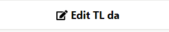

# {{ page.title }}

Before starting any translation,
**make sure you read through the translation guidelines below and the**
**[Lifecycle of a CV section](lifecycle.html).**

## Translation guidelines

### Vocabulary names

CV names are translated.

CV short names, on the other hand, are machine-actionable and remain
the same across the languages. They are thus not translated. This
ensures interoperability across systems. The CESSDA vocabulary tool
does not allow translation of the short names.

### Vocabulary descriptions

CV definitions should be translated.

### Vocabulary notes

Translate if they concern the use or other information that is
relevant to your language version as well. If the notes in DDI SL
vocabulary refer to where the DDI SL vocabulary was first published,
this may not be information that is needed for your language version.

### Code values

Code values are machine-actionable and cannot be translated. They are
used to connect the different language versions of a code.

### Descriptive terms

All code descriptive terms should be translated. It is recommended
that the translation of descriptive terms be as close as possible to
the source terms, to keep the hierarchy visible. However, some
flexibility is allowed. Descriptive terms are used in study
descriptions in search interfaces to let users know in a
human-readable form what the class entails, thus the translations of
descriptive terms should be understandable to researchers and other users in your language.
This helps users to both find the data they are searching for, and to
understand the methodology used to collect the data, even when they
only see the term and not its definition.

In some rare cases, the form of the term may vary. For example, it
might be more appropriate to translate a plural term in English by a
singular term in Finnish, or vice versa. Similarly, it might be better
to translate a single word term in English using a multi-word term in
Finnish, or vice versa. In Finnish, for instance, 'Summary' was
translated as 'Yhteenveto, lyhennelmä tai tiivistelmä' since
no single word in Finnish conveyed the meaning.

It is recommended that expert advice should be obtained on the best
equivalences for terms in your language.

### Term definitions

Translating code/term definitions is not mandatory.
However, to ensure standardised and consistent metadata across countries and
organisations,
it is recommended to provide access to the definitions either in
English or in the local language for those producing documentation.
When translating definitions, aim to translate the source as closely as
possible. However, if a sentence in a definition proves very hard to
translate, you can express it in a slightly different way, as long as
you preserve its **meaning**. Check that the translated definition
allows the term to be used consistently, and in a similar fashion to
the source term, in documentation. You may add examples relevant to
your users.

### Interoperability between systems

Interoperability between systems is guaranteed by the values of the
codes and the CV short names entered in the metadata. Therefore these
are the same across languages and are thus not translated.

## Adding a first-ever translation to a published CV

### Vocabulary-level information translation

Sign in (top right hand corner of the screen) to the system and select
the CV you wish to translate from the Editor search.

Choose the 'Add translation' button to the left.

A pop-up window will appear where you can choose the language to translate the CV into.
The screenshots below use Danish (two-letter code - da) or Finnish (fi) examples.

Choose the language. The system allows you to select those language(s)
for which you have been granted translator rights.

Translate the CV name and the CV definition into your language. Both
are shown in the source language at the top. The short name cannot be
changed as it is used to link the translations to the source CV and is
the same across languages.

Add your agency to the 'Translating agency' field and a link to the
agency. Remember to save. Note: it is best to copy and paste the link to
the agency from the internet, the system does not add the 'http//:'
automatically.

In the detailed page view, click on your two-letter language code on
the right hand side to start translating the codes.

You can edit the CV name, CV definition or translating agency
information you have just added using this button on the left hand
side of the screen.

As this is your first ever draft translation of the vocabulary and it has never been published,
you are not asked to enter any change types, even if you
edit the information already entered. Versioning only applies between
published versions.

You can cancel at any time and no changes will be made. Remember to
save if you have made changes.

### Code-level translation

To translate a code, click on the row. This turns blue and shows your
options on the left hand side.

The pop-up window shows the descriptive term and the definition for you to translate.
Make your translations in the relevant fields and save.
The system does not allow you to save if you have not translated the descriptive term; this is mandatory.
Do this for all codes. Definition translation is optional but strongly recommended.
Having definitions is the only way to ensure consistent use of the terms across languages and organisations.

You can edit a code translation by first clicking on a translated code
and then clicking on 'Edit code translation' button. A code editing pop-up window
opens. As this is your first ever draft translation that has never
been published, no change types are asked by the system, even if you
edit the code-level information. Versioning only applies between
published versions.

If entering codes from an already existing controlled vocabulary, you
can enter the codes by using the 'Import codes from CSV' functionality
(see [Import codes from CSV section](import-from-csv.html) for step by step details of how to do this).
This is quite challenging, so consult the Service Owner before doing this.
If it is a short vocabulary, it is safer to copy and paste the translations.

Once you have translated the descriptive terms and their definitions, and are happy with your translations,
you can download/export your draft CV and ask people to comment on it.

When changes have been agreed, change the status from 'Draft' to
'Review' and finalise the CV.

 When all is ready, move the status to ‘Ready to publish’.

The ‘Ready to publish’ pop-up window appears.
Do not change the licence for CESSDA or DDI vocabularies as all language variants should be published under the
same CC-BY licence as the source language. If you select closing or saving  the pop-up, the status is not changed
and remains in REVIEW.  Select ‘Ready to publish’ in the pop-up to change the status. When the status is changed
to ‘Ready to publish’, the language version is frozen and cannot be edited anymore. TL admins do not have publishing rights.
At some agreed point, SL admin publishes the SL and those TLs that are in the ready status, all together.
The whole publication package with all language variants is published under the same version number. See the ‘Versioning’ section
for more information on the versioning policy.

If your translation was not finalised and remains in draft or review status,
it will not be included in the current publication package.
You will need to finalise your translation and move it into ‘Ready to publish’ status.
It  will then be published at the next publishing round.

You can translate an already published vocabulary into your language for the first time by selecting ‘Add translation’.
Likewise, you can change your already published translation by selecting ‘Create new version TL’, even without the SL changing.
In both cases, when your translation is finalised and moved into  ‘Ready to publish’ status, it will only be published when SL admin
publishes the vocabulary package for the next time. There might be an agreed publication schedule or you will need to discuss
this with SL admin. It is better not to have too frequent publications, as organisations using the vocabulary for metadata and in their
systems need to keep up with versions.

You can delete the TL CV when the status is DRAFT or REVIEW, by clicking on Delete TL (language).

Please note that this action does not change the status of the CV back
to the previous status (e.g. from REVIEW to DRAFT) but drops the whole
version.
**Be careful with 'Delete TL' when doing the first
translation version; if the translation has not yet been published, this
action drops the whole translation so any information entered will
be gone forever. If needed, make a download/export of your translation first and save it.
If the translation has already been included in a publication package,
i.e. it is not the first-ever translation, make sure to delete only the current draft translation.**

See [Usage](usage-tab.html) and [Licence and citation](licence-citation-tab.html)
sections for information about the usage, copyright and licensing of CVs.

### Creating a new version of a translated, published CV

To update a published translation, you will need to create a new TL version and repeat
the previous steps with slight variations. Note that you can change CV notes information
at any time without having to create a new TL version using the ‘Edit’ button next to the notes field.

You can edit CV level information, that is, the translated CV name, CV
definition, translating agency information and vocabulary notes
through the 'Edit TL'.

**Make only one change at a time**, since now
you need to add a change type in the pop-up window and you can only choose
one change type at a time. It is worthwhile to make changes in this
manner, as this will allow the system to produce an accurate draft
version history for you in the 'Ready to publish' pop-up window, so you do not need to
keep manual notes to yourself of changes made. Change information is
needed for versioning and for letting users know what has changed.

The reasons for change presented in the drop-down list for CV-level
information:

- CV name changed

- CV definition amended with meaning change

- CV definition rephrased

- Translation agency and/or link edited.

If you accidentally make more than one change at a time in an editing pop-up window,
enter one appropriate change type  and make a careful manual note to yourself of other changes made.
You will need to add  these other changes manually in the ‘Ready to publish’ pop-up window later.
The changes made but not documented by change type  in the pop-up window will not be included in
the machine-produced change logs but the changes can be seen in the comparison table.

For editing the codes, click on the code you want to change, then
choose the 'Edit code' button to enter your changes.

Before you can save, you will need to give the reason for the change.
There are three possibilities, depending on the changes made:

- Code descriptive term rephrased

- Code definition amended with meaning change

- Code definition rephrased

Note: When a code has been removed or added to the source, causing the same changes to the TL version,
the information ‘Code removed’ and ‘Code added’ are automatically added by the system to the change log,
comparison table and ‘Version changes’ field in the ‘Ready to translate’ pop-up window.

Further information on the meaning of these is on the DDI Alliance
website under the versioning policy:
[DDI Alliance Controlled Vocabularies](https://www.ddialliance.org/controlled-vocabularies)

Again, you will need to go from draft status to review.

You can drop this TL version when the status is DRAFT or REVIEW, by clicking on ‘Delete TL ’ button.
Choose ‘Delete CV TL’ in the pop-up window if you want to drop the version.

**Please note that this action does not change the status of the TL to
the previous status (e.g. from REVIEW to DRAFT) but drops this
particular version of the TL and returns to the previously published TL
version.** You will lose all information entered for the new version.

The system in general does not allow returning to the previous status.

When you are satisfied with your edited translation, click on the ‘Ready to publish TL’ button.
A pop-up window appears where you can enter information about the changes between this TL version and the previous one.
If you have done one change at a time and have chosen the correct change type, the system already has information
on changes in the change log and in the ‘Version changes’ field.

Check that the ‘Version changes’ field includes correct information and all the changes made.
Check this by opening the comparison table in the pop-up window.
The table shows all changes between
the current and previous version. If the code where the changes have
occurred (e.g. if the descriptive term has changed) is missing, add the
code and change type to the Version changes field manually. Remove any duplicates.

If a code value or descriptive term has been changed, users benefit from more detailed information in ’Version changes’
than what has been produced by the system. There it is best to first state the change type and then say that [x]
has been changed to [y]. See below for more detailed advice.

The information you enter in the ‘Version changes’ and ‘Version notes’ fields in the ‘Ready to publish’ pop-up window
will be displayed in the ‘Versions’ tab in the user interface and will be visible to all. It is vital to document all
changes made between the previous and new TL version correctly. This will allow organisations using the vocabularies
to update their metadata and any vocabularies implemented in their systems.

If you notice afterwards that you did not include all changes or there is something else to amend, you can edit the
version history of the latest published TL in the Editor without needing to create a new TL version.

## Advice on how to document changes in TL version history

If a code has been deprecated: *Code deprecated: Health.HealthBehaviour*

- The system automatically copies this change information in the required format to the version logs
  and ‘Version changes’ field for the ‘Ready to publish’ pop-up window.
  If not, they can be copied from the SL version tab to the TL pop-up window.
  Code value should be used to indicate the deprecated term.

If a code has been added: *Code added: Health.DietAndNutrition*

- The system automatically copies this change information in the required format to the version logs
  and ‘Version changes’ field for the ‘Ready to publish’ pop-up window.
  If not, they can be copied from the SL version information.
  Code value should be used to indicate the code/concept added.

If a code value has been changed: *Code value changed: Health.Public changed into Health.PublicHealth*

- If not copied by the system to the TL pop-up window, copy the information from the SL version tab.
  To facilitate machine actionability of metadata updates, it is best to record both the old and the new code.
  See the example above.

If a code definition has been amended or rephrased: *Code definition rephrased: Health.PhysicalFitnessAndExercise*

OR *Code definition amended with meaning change: Physical fitness and exercise*

- Code definition changes may be language specific, so you should document them only if a corresponding change has
  been made also in your own language. For instance, if a definition has been rephrased in English,
  it may be that there is no need to change the definition in your TL. In that case, do not include
  the SL change into the TL version history. You may also have rephrased a definition in TL when there
  was no corresponding change in the SL. In that case, you need to document the change in the TL version history.
  Use the code value to indicate in which code the change took place.

If a descriptive term has been changed:
*Descriptive term amended with meaning change: Yhtäläiset oikeudet changed to Yhtäläiset oikeudet ja mahdollisuudet
Descriptive term rephrased: [x] changed to [y]*

- These are language specific, so you should enter only when these have changed in your own language.
  Use the old descriptive term in your language for [x] and the new one for [y].
  It is best to record both, as it makes it easier to introduce automated updates to metadata.

You also need to consider whether to add general information to the ‘Version notes’ field in the
pop-up window to explain the changes you have made since the previous version. For example,
that you translated the definitions of the codes for this version, or some other notes.

Version information is editable in the Editor after CV publication for the latest published version,
without the translator having to create a new version of the TL vocabulary to amend the information.
