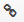

# {{ page.title }}

This section shows how the CV is being used.

The usage information can be added using the 'Edit' button on the
right-hand side of the Usage tab. This opens a rich-text box to enable
you to add links, tables etc.

**Usage for DDI (and CESSDA) vocabularies.**

CVs that are used within DDI have details of how they are used within
various versions of DDI. The DDI Alliance can provide details of
usage.

For example mode of collection has the following usage information:

DDI 3.2

Module name: datacollection

Element name: [TypeOfModeOfCollection](http://www.ddialliance.org/Specification/DDI-Lifecycle/3.2/XMLSchema/FieldLevelDocumentation/schemas/datacollection_xsd/elements/TypeOfModeOfCollection.html)

DDI 2.5

Element number: 2.3.1.6

Element/attribute name: [collMode](http://www.ddialliance.org/Specification/DDI-Codebook/2.5/XMLSchema/field_level_documentation_files/schemas/codebook_xsd/elements/collMode.html)

You can create a hyperlink by overshadowing the text to be linked and
by clicking on the 'link' icon 
on the top row of the box and adding the URL there.

For translations of DDI and CESSDA vocabularies, it is best to copy
the Usage information from the SL version. Editing or translating the
copied Usage information text is discouraged, at least for DDI
vocabularies. This is because in future, the Vocabulary Service may enable
translations to inherit the SL Usage information and its updates
automatically. Any translations of it would therefore disappear, but
the advantage is that translators would not need to update Usage
information manually.

If you amend the usage information in the SL, it is best to copy this
amended information to the TLs as well, at least for CESSDA and DDI
vocabularies, or inform the Content Contact.
