# {{ page.title }}

This guide covers use of the CESSDA Vocabulary Service tool (CVS). It
provides information on how to add a controlled vocabulary (CV) to the
tool and its subsequent maintenance.

Within the CVS, each controlled vocabulary is created in a source
language (SL). Both CESSDA and DDI use English as the source language.
Once an SL of a CV has been published, a translated version, hereafter
referred to as 'target language' (TL), can be produced. A vocabulary
can be translated into multiple languages.

You must have a CVS account and be logged into the system to add or
edit a vocabulary. Depending on your role, you will be able to edit an
SL vocabulary or one of the TLs at various stages in the workflow.
**Actions where extra care is required before finalizing are noted in
red, bold type, like this sentence.**

## 2 Vocabulary management

### 2.1 Creating and publishing a new SL CV

Sign in (top right hand corner) and select Editor from the top menu.
All actions that you can perform are presented as a series of buttons
in the list down the left hand side of the tool (depending on your
account type, these may vary).

● 'Add new CV' allows you to start a new CV from scratch.

● If you click on one of the listed CVs, you will see 'CV actions'
that allow you to make changes to the vocabulary as a whole, including
options to Add new CV, Add translation, Create new version and Delete
that version of the vocabulary or the whole vocabulary.

For now, Choose 'Add new CV'.

A new draft with a version number 1.0 DRAFT is created. You can edit
this draft using the editing buttons.

There are several mandatory fields to complete, marked with a red
asterisk.

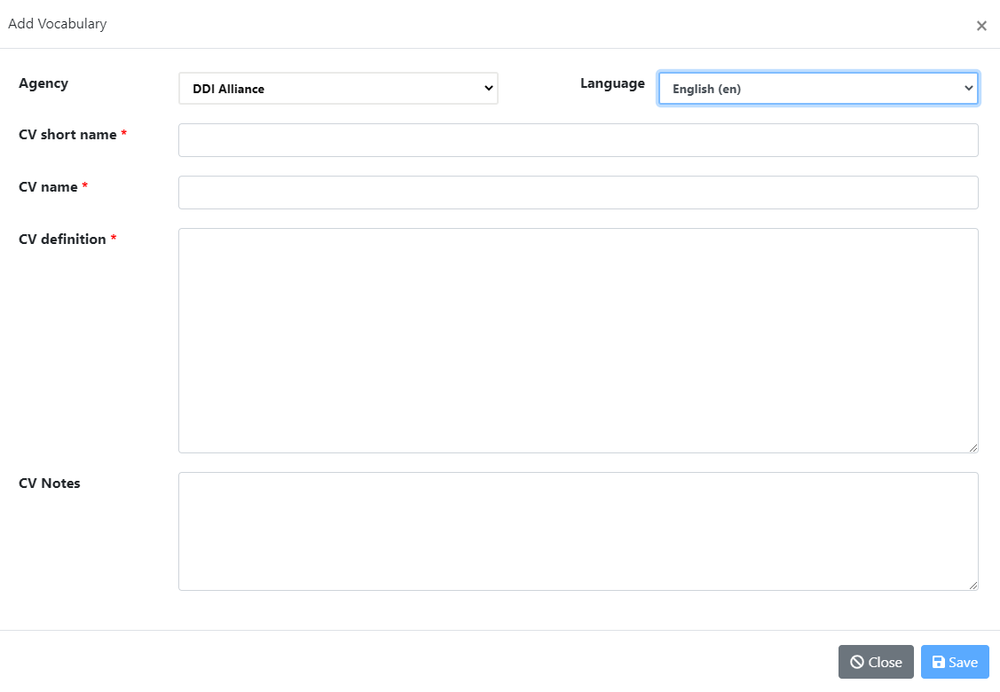 "Image 1")

* Agency *

Choose the Agency from the drop-down list - the most commonly used
ones are CESSDA or DDI. The agency you can choose depends on your
rights and role. If the Agency you require is not available you will
need to discuss the possibility to add with the Content Administrator,
that is, the CVS Content Contact (contact details at the end of the
document).

* Language (source) *

Choose the source language; for both CESSDA and DDI CVs, this is
English. Other languages are in the drop-down list in preparation for
future use. The tool may also be used for in-house thesauri.

* CV short name (code) *

This is a machine-actionable field. Add the short name (Code) for the
CV using the rules specified in the table. If you are entering a CV
that has already been published elsewhere, the same short name used
elsewhere should be used here. If you are entering a new vocabulary,
please follow the rules laid down. If you try to enter a short name
that already exists within the CVS, the system will prevent you from
saving it.

Please check the short name carefully before saving in case of errors.
**Important: read the code naming rules carefully first and take care
to ensure that code is correct from the start** . As this code is the
ID for the vocabulary, **it is no longer possible to edit it once it
has been saved**.

If you do make an error in the CV short name code, you should proceed as
follows:

If the CV is unpublished:

1\) Delete the SL vocabulary (if unpublished)

2\) Create a new CV with the corrected short name.

If the CV has already been published:

1\) Produce and save an export/download of the vocabulary in its
current state, including all language versions, for reference.

2\) Delete the CV. This will delete all versions of it and all other
language versions that have been created.

3\) Create a new CV with the corrected short name, copy pasting from
the saved file. Ensure that you enter the same version number and
version information as shown in your download. It is not possible to
bring earlier versions back to the system. You need to send the saved
file to translators and ask them to copy paste their translation.
There is no copying functionality available within the CVS yet, so it
is best **not** to make an error in the short name code, as recreating
the CV will mean a lot of manual copying. You can access the deleted
CV in the Editor.

+-----------------------------------------------------------------------+
| **Rules for creating code values for source language vocabularies** |
|                                                                     |
| *(adapted from original rules created by Joachim Wackerow)*         |
|                                                                     |
| Code values within CESSDA Vocabulary Service to which these rules   |
| apply are: ● the **CV short name**                                  |
|                                                                     |
| ● the **Code value**.                                               |
|                                                                     |
| Code values should be self-describing and are based on the          |
| human-readable descriptive term in question.                        |
|                                                                     |
| Code values are created in the SL version. TL has the code values   |
| of the SL, and the values cannot be edited in TL.                   |
|                                                                     |
| A code value is a single word or a concatenation of several words:  |
|                                                                     |
| ● Each word starts with an upper case character.                    |
|                                                                     |
| ● Only alphanumeric characters are allowed, as well as: + - :       |
|                                                                     |
| ● No slashes (/) are allowed in the code value: they should be      |
| replaced with 'Or', e.g. EventOrProcess, or left out altogether, if |
| seems a better alternative.                                         |
|                                                                     |
| ● No abbreviations are allowed. Only a few exceptions are allowed   |
| in the case of acknowledged abbreviation code lists, such as the    |
| two-letter ISO code for the US.                                     |
|                                                                     |
| Code values should be not too long, to ensure readability. There is |
| no hard rule, but it is reasonable to use no more than 5 words and  |
| 50 characters. In the CVS tool, if spaces are added within a code,  |
| the system will automatically remove them.                          |
|                                                                     |
| The code value is just a code value, and its purpose is to be       |
| machine-actionable. Search interfaces should search on the list of  |
| captions (descriptive terms) and/or definitions i.e. the            |
| human-readable part.                                                |
|                                                                     |
| The same instructions apply for the CV short names. For instance,   |
| the short name of Mode of Collection vocabulary should be           |
| 'ModeOfCollection'.                                                 |
+-----------------------------------------------------------------------+

+-----------------------------------------------------------------------+
| *Hierarchical CVs*                                                  |
|                                                                     |
| One code value exists for each hierarchical level. The upper level  |
| values (broader term values) are repeated. The concatenation of the |
| codes of all levels are used as an allowed value in DDI. The        |
| separator between the levels is a dot. Examples:                    |
|                                                                     |
| ● Longitudinal.Panel.Continuous                                     |
|                                                                     |
| ● SelfAdministeredQuestionnaire.WebBased                            |
|                                                                     |
| Note that in CESSDA Vocabulary Service, the hierarchy in the Code   |
| value is introduced by the system. The user only enters the code    |
| value for the particular code itself (e.g. Continuous). **When the  |
| item is made a 'child' of another item, the system adds the upper   |
| level, i.e. the hierarchy,** to the code value automatically        |
| (Longitudinal.Panel.Continuous).                                    |
+-----------------------------------------------------------------------+

* CV name (human-readable title of the CV) *

Next, add a name for the CV.

* CV definition *

Add a definition that describes the vocabulary. Now click on Save to
save the CV. Note: You will not be able to save the entry if the CV
already exists, i.e. the CV short names are identical.

* CV notes *

These are notes that apply to the whole vocabulary. For example,
information that this vocabulary is to be used with quantitative data
only. The notes entered here can later be edited in the Editor by the
SL Admin, without having to change the version of the CV. Notes do not
therefore affect versioning.

### 2.2 Adding codes and editing your new, not-yet-published CV

There are now several actions you can take.

 "Image 2")

You can make changes to the vocabulary level fields you have already
added by using the 'Edit SL en' button (en=English). Do one change at
a time, choose change type and remember to save. Doing one change at a
time will allow the system to produce a correct version history
information for you in the publishing pop-up later.

If you close the pop-up without saving, no changes will be made.

 "Image 3")

You can choose to delete your whole draft CV at any point before
publication. Click on 'Delete CV.' **Be careful with Delete CV; since
this is the first ever version of the vocabulary, the whole CV will be
erased. If needed, save an download/export of the draft CV in your
files before deleting.** Clicking on 'Cancel' in the deleting pop-up
will retain the CV.

 "Image 4")

'Add code' allows you to add codes (terms) within the CV. The system
adds the new code to the end of the vocabulary. Complete the 'Code
value' field using the rules stated above (pages 5-6), add the
descriptive term and definition, and click Save. If you like to see
the code on one line in the Details tab, you can extend column length
by dragging on the line.

The Editor puts in numbers in front of the code. These are just for
checking purposes, they will not be displayed in the published
vocabularies in the Home view, so you can ignore them.

### 2.3 Creating a hierarchy

CVs can be hierarchical. First, add the new code using the 'Add code'.
If there are already other codes entered, you can create a hierarchy
in this pop-up already. Another option is to do it later by using
'Move code' action button.

**Note that in the code value element only the value for the
individual term is to be entered in the code pop-up; the hierarchy in
the code (i.e. broader term code value) is added by the system.**

Creating hierarchy in the 'Add code' pop-up

 "Image 5")

If you want your new code to be the last one in the code list, just
click on 'Save' after you have entered code-level information needed.
You can arrange codes and hierarchy later using the 'Move code'
button.

If you want to place your new code somewhere else in the list already
in this pop-up: click on the code you want to move your new code next
to and select from the blue action buttons whether you want to place
your new code as a child or as next or following code at the same
level as the code you clicked. The code list will change accordingly.
Note that the system will add hierarchy to the code value if you make
it a child, adding the broader term code value in front of your new
code in code value. If you chose to select your new code to be
inserted before or after a child code, it will also become a child.

If you are happy with the order, save. If not, use the buttons to
arrange further.

Using 'Move code': Click on the code in the table in Details tab, and
choose 'Move code' from the action buttons. In the moving pop-up,
click on the code you want to move the other code next to and select
from the blue action buttons whether you want the other code to come
before or after or as a child.

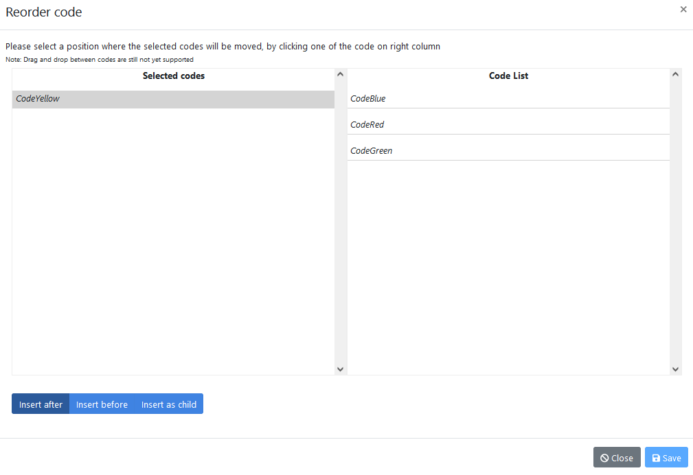 "Image 6")

If you want to move *CodeYellow* to be the child of *CodeGreen*, click
on *CodeGreen* in the list on the right and select 'Insert as child'.
Now you see in the Code List the change made, with hierarchy
introduced into the code and can save.

If you now want *CodeRed* to be a child of *CodeGreen* as well but to
be placed above *CodeYellow*, click on *CodeRed* in the Details tab
table, and select 'Move code' from the actions. In the moving pop-up,
click on *CodeGreen.CodeYellow* and select 'Insert before' as the
action. You can now see *CodeYellow* in its right place as a child
above *CodeYellow*. Remember to save.

 "Image 7")

Dragging is no longer possible in this
version of the software since it caused various problems. Note: Codes
can only be ordered within the SL - this is not an option for
translations.

### 2.4 Editing codes

All edit buttons for a code will appear when you click on a code in
the table. Term-level values of the code are editable, unlike the
CV-level Short Name (see above). Descriptive terms and definitions can
be edited as well.

 "Image 8")

The rest of the items can now be added to the CV.

Note that deleting a parent code (broader term) deletes the children
as well. If you want to keep the children, use 'Move code' pop-up to
insert them before or after another broader code first. You can
rearrange the hierarchy later.

If entering codes from an already existing controlled vocabulary, you
can enter the codes by using the 'Import codes from CSV'
functionality. This is quite complicated, so contact the CVS Content
Contact first.

 "Image 9")

Codes need to be in csv format. Instructions for preparing DDI and
CESSDA vocabularies for import from Excel to csv:

1\. Open a new Excel spreadsheet, copy paste the code values, terms
and descriptions from the existing Excel format of the CV, using
'Paste special' and selecting Unicode text (UTF-8).

2\. Add a new row at the top of the file and add suitable text in each
of the three columns to create column headers (e.g. 'Code value' in
column A, 'Term' in column B and 'Description' in column C). Your
Excel file should now look like this:

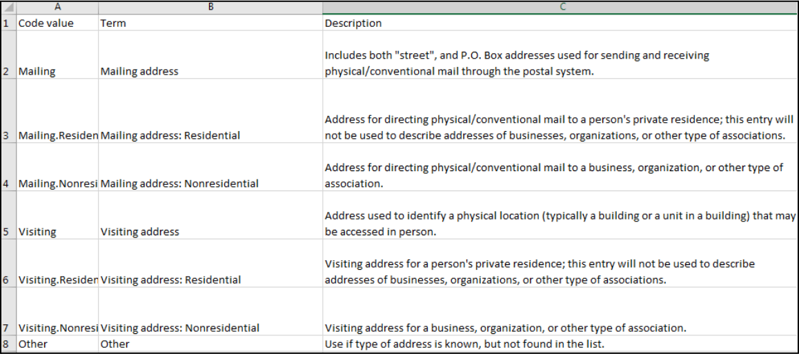 "Image 10")

3\. Check the descriptions. If there are any words with quotation
marks around them like "street" in the image above), replace the
quotation marks with ' ('street').

4\. Save the Excel in CSV (comma delimited) format.

5\. Open the CSV file in Notepad++, Oxygen or another text editor
where you can see how it displays. Check that you do not have any
information apart from the column headers in the first row (see
above). Code values, terms and definitions need to be separated by a
comma, so if other characters such as semi-colons (;) have been used,
they will need to be replaced with commas (,). If needed, convert
encoding to UTF-8 (note that some basic text editors do not have the
option to convert the encoding). Check that description texts have
quotation marks before and after them. Add any that are missing, and
save.

 "Image 11")

5\. In the CVS tool, click on the button 'Import codes from CSV'.
Browse to select the file. The file name will 'flash' and disappear.
Close the window. You should now see a list of codes to be copied. If
not copied, check that you have the quotation marks in right places
and no slashes (/) within definitions.

6\. Click on 'Import codes'. Browse and select the CSV file. You will
see a table displaying the codes to be added. Now either click on
'Import codes', or cancel.

Note that the import only brings in code-level information, all else
needs to be added manually.

### 2.5 Reviewing the CV

Once all the codes have been added, ordered and any changes have been
made the CV is ready to be reviewed by others with relevant roles.
People with contributor roles can view and amend the CV in 'Draft'
status.

When the vocabulary has been reviewed, change the status to 'Review'.
Now persons with a contributor status can view the vocabulary but no
longer edit it, only the admin can.

 "Image 12")

The screen will display the vocabulary as it is after all changes
made. However, in 'Review' status, changes can still be made to all
parts of the CV.

Once the CV is finalised, the vocabulary can be published. Only the
Source Language Administrator (Admin_SL) has the right to publish and
has the 'Publish' button.

It is important to review all information before publication,
including proofing all text, adding usage for vocabularies and
checking the licence is correct. Double-check that the version number
is correct. If this is a new controlled vocabulary that has never been
published anywhere before, the version is 1.0. If it is already
published elsewhere but new to the CVS tool, the current version
number of the controlled vocabulary should be added, whatever it is.

You can save your changes before publishing. Once the vocabulary is
ready to publish, click on the Publish SL button.

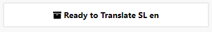 "Image 13")

Publishing allows this version of the CV to be viewed by all. Now
translations can be added to this published CV, or a new version of
the published CV can be created.

See sections 4 and 5 for information about the Usage and Copyright and
Licence tabs.

### 2.6 Creating a new version of a SL CV

Once a CV has been published the SL cannot be edited; only
translations can be added. To update the SL of a published CV, you
need to create a new version. See section 3.3 on Versioning for
details on whether this will be a major or minor version of the CV.

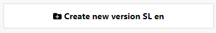 "Image 14")

Choose 'Create new version' from the left hand side action. The pop-up
window shows the current version information, if this is a third
version or later. Here you can start internal discussion notes for the
new version. If any discussion notes have been inherited from the
previous version and are no longer needed, you can delete them.

The version will have now changed to (DRAFT).

You now have choices as before:

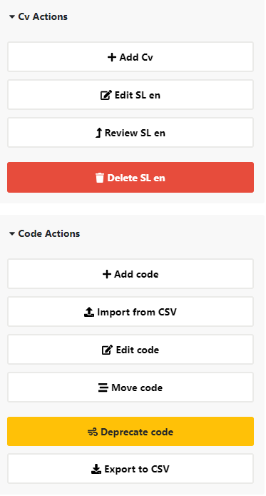 "Image 15")

You can make changes to the CV-level information using the 'Edit SL
en' button. CV Notes can be edited at any time by using the 'Add
notes' or 'Edit notes' buttons, before or after publication, without
this affecting the versioning.

When you make changes you will also need to include a reason for the
change, selected from the drop-down list:

● CV name changed

● CV short name changed

● CV definition amended with meaning change

● CV definition rephrased

**Only one change can be made at a time - select the change type and
save.** If you need to make more CV-level changes, open 'edit SL'
again and make the next change, select the change type and save. As
the system only allows users to enter one change type at a time, it is
only possible to record all by making the changes separately. The
change logs needed for version history will then include everything.
If you accidentally made more than one change at a time, enter one
change type and make a note for yourself to add the other change
manually later to version change information.

Note: If you add or delete a code, the system records this change
automatically to the version changes.

Change information is needed for versioning and for letting users know
what has changed. There is also an option to describe the changes you
have made in more detail in the description field of change notes in
the pop-up.

'Edit code' allows you to update the information about that code. When
you do this you will need to add a reason for the change (Type) from
the drop-down list before you can save. Make only one change at the
time and choose change type carefully, it cannot be changed
afterwards. Your change choices are:

● Code value changed

● Code descriptive term rephrased

● Code definition amended with meaning change

● Code definition rephrased

There is also a non-mandatory field, 'Description', where you can add
any other information about the changes made, if needed, such as the
reason for the amendments.

**You can cancel at any time and no changes will be made. Remember to
save if you have made changes. Take care to check that you have the
correct change type before saving.**

If you have accidentally made more than one change at a time,
introduce one appropriate change type and make a careful manual note
to yourself of the other changes made. You need to add them in the
publishing pop-up manually later.

When everything is ready, click on Publish.

 "Image 16")

At the publish pop-up you can see the changes between this version and
the previous one.

Finalise 'Version changes' field manually by adding any missing
information, for example, in which codes the changes have taken place.
You can see this information when you click open *Show comparison with
previous version* section, there are change logs at the end of
comparison

view. Verify from the comparison and change logs that all the changes
have been documented to version changes. You can also now correct an
error in change type in this field as it is editable.

Free-text descriptions added to each change are shown by the system at
the top. Consider whether to add them to version notes. You can
manually edit version notes.

Check that all changes that have been made are documented according to
the rules of the DDI Alliance (CESSDA follows the same rules),
detailed on the controlled vocabularies web page under the versioning
policy:

[http://www.ddialliance.org/controlled-vocabularies]{.ul}

Check version number (see sections 3.2.2 and 6 on Versioning),
updating it if necessary. The 'Versions' tab will have details of all
changes to the version visible for users.

It is possible to add or edit information in version notes and version
changes in the Versions tab after publication, so you can correct
mistakes made in version information after publication without this
affecting the version number.

### 2.7 Deleting a SL CV version or the whole vocabulary

Deleting a version: You can delete the new version of the CV when the
status is DRAFT or REVIEW. Click on 'Delete version' and choose
'Delete SL CV and TLs v. x.x.' Please note that this action does not
change the status of the CV to the previous status (e.g. from REVIEW
to DRAFT) but drops the whole version, returning to the previous
version of the CV. There is no way to change status back once the
version is dropped. Returning to the previous status is never possible
in the system. **Take care not to choose 'Delete CV' as this will
erase the whole vocabulary and all its translations.**

Deleting the whole CV: This will erase the whole vocabulary and all
its translations. Do not do this without consulting the TL admins.
When you delete a CV from the system, **the same CV short name cannot
be reused for a new CV**. The system prevents this and only a
technical administrator can change this.

## 3 Vocabulary translations

Before starting any translation, make sure you read through the
translation guidelines below.

### 3.1 Translation guidelines

**Vocabulary names

CV names should be translated.

CV short names, on the other hand, are machine-actionable and remain
the same across the languages. They are thus not translated. This
ensures interoperability across systems. The CESSDA vocabulary tool
does not allow translation of the short names.

**Vocabulary descriptions

CV definitions should be translated.

**Vocabulary notes

Translate if they concern the use or other information that is
relevant to your language version as well. If the notes in DDI SL
vocabulary refer to where the DDI SL vocabulary was first published,
this may not be information that is needed for your language version.

**Code values

Code values are machine-actionable and cannot be translated. They are
used to connect the different language versions of a code.

**Descriptive terms

All code descriptive terms should be translated. It is recommended
that the translation of descriptive terms be as close as possible to
the source terms, to keep the hierarchy visible. However, some
flexibility is allowed. Descriptive terms are used in study
descriptions in search interfaces to let users know in a
human-readable form what the class entails, thus the translations of
descriptive terms should be commonly used in the local language. This
helps users to both find the data they are searching for, and to
understand the methodology used to collect the data, even when they
only see the term and not its definition.

In some rare cases, the form of the term may vary. For example, it
might be more appropriate to translate a plural term in English by a
singular term in Finnish, or vice versa. Similarly, it might be better
to translate a single word term in English using a multi-word term in
Finnish, or vice versa. In Finnish, for instance, 'Summary' was
translated as 'Yhteenveto, lyhennelmä tai tiivistelmä' since
no single word in Finnish conveyed the meaning.

It is recommended that expert advice should be obtained on the best
equivalences for terms in your language.

**Term definitions

Translating code/term definitions is not mandatory. However, to ensure
standardised and consistent metadata across countries and
organisations, you need to provide access to the definitions either in
English or in the local language for those producing documentation.
When

translating definitions, aim to translate the source as closely as
possible. However, if a sentence in a definition proves very hard to
translate, you can express it in a slightly different way, as long as
you preserve its **meaning. Check that the translated definition
allows the term to be used consistently, and in a similar fashion to
the source term, in documentation. You may add examples relevant to
your users.

**Interoperability between systems

Interoperability between systems is guaranteed by the values of the
codes and the CV short names entered in the metadata. Therefore these
are the same across languages and are thus not translated.

### 3.2 Adding a first-ever translation to a published CV

#### 3.2.1 Vocabulary-level information translation

Sign in (top right hand corner of the screen) to the system and select
the CV you wish to translate from the Editor search.

Choose the 'Add translation' button to the left.

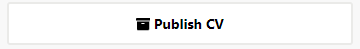 "Image 17")

A pop-up window will appear where you can choose the language to
translate the CV into. This example uses Danish (two-letter code -
da).

Choose your language, if not already presented. It is only possible to
select the languages that you have been given translator rights to.

Translate the CV name and the CV definition into your language. Both
are shown in the source language at the top. The short name cannot be
changed as it is used to link the translations to the source CV and is
the same across languages.

Add your agency to the 'Translating agency' field and a link to the
agency. Remember to save. Note: it is best to copy paste the link to
the agency from the internet, the system does not add the http//:
automatically.

In the detailed page view, click on your two-letter language code on
the right hand side to start translating the codes.

You can edit the CV name, CV definition or translating agency
information you have already added using this button on the left hand
side of the screen.

 "Image 18")

As this is your first ever draft translation that has never been
published, you are not asked to enter any change types, even if you
edit the information already entered. Versioning only applies between
published versions.

You can cancel at any time and no changes will be made. Remember to
save if you have made changes.

#### 3.2.2 Code-level translation

To translate a code, click on the row. This turns blue and shows your
options on the left hand side.

 "Image 19")

The pop-up box shows the descriptive term and definition for you to
translate. Make your translations in the relevant fields and save. The
system does not allow you to save if you have not translated the
descriptive term; this is mandatory. Do this for all codes.

You can edit a code translation by first clicking on a translated code
and then on 'Edit code translation' button. A code editing pop-up
opens. As this is your first ever draft translation that has never
been published, no change types are asked by the system, even if you
edit the code-level information. Versioning only applies between
published versions.

If entering codes from an already existing controlled vocabulary, you
can enter the codes by using the 'Import codes from CSV'
functionality. This is quite challenging, so consult the CVS Content
Contact before doing this. If it is a short vocabulary, it is safer to
copy paste the translations.

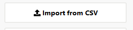 "Image 20")

Codes need to be in csv format. Instructions for preparing DDI and
CESSDA vocabularies for import from Excel to csv:

1\. Open a new Excel spreadsheet, copy paste the code values, terms
and descriptions from the existing Excel format of the CV, using
'Paste special' and selecting Unicode text (UTF-8).

2\. Add a new row at the top of the file and add suitable text in each
of the three columns to create column headers (e.g. 'Code value' in
column A, 'Term' in column B and 'Description' in column C). Your
Excel file should now look like this:

 "Image 21")

3\. Check the descriptions. If there are any words with quotation
marks around them (like "street" in the image above), replace the
quotation marks with ' ('street').

4\. Save the Excel in CSV (comma delimited) format.

5\. Open the CSV file in Notepad++, Oxygen or another text editor
where you can see how it displays. Check that you do not have any
information apart from the column headers in the first row (see
above). Code values, terms and definitions need to be separated by a
comma, so if other characters such as semi-colons (;) have been used,
they will need to be replaced with commas (,). If needed, **convert**
encoding to UTF-8 (note that some basic text editors do not have the
option to convert the encoding). Check that description texts have
quotation marks before and after them. Add any that are missing. Save.

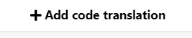 "Image 22")

6\. In the CVS tool, click on the button 'Import codes from CSV'.
Browse to select the file. The file name will 'flash' and disappear.
Close the window. You should now see a list of codes to be copied.

7\. Click on 'Import codes'. Browse and select the CSV file. You will
see a table displaying the codes to be added. Now either click on
'Import codes', or cancel.

Once you have translated the descriptive terms and definitions, and
are happy with your translations, you can ask people with a
contributor role to review and possibly amend the vocabulary. It may,
however, be simpler and safer to just make an export of your draft CV
and ask people to comment on that. It removes the need to give them
access rights and roles.

 "Image 23")

When changes have been agreed, change the status from 'Draft' to
'Review' and finalise the CV. Contributors can see the CVs in Review
status but they do not have editing rights anymore. When all is ready,
you can publish.

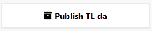 "Image 24")

Publication requires that all descriptive terms from the SL CV are
translated. The system gives a warning if this is not the case.
Descriptive term translation is mandatory. Definition translation is
optional, but do consider the user needs for this.

Version number: translations have a three-digit version number. The
first two digits are the version number of the SL CV, and the third is
a running number, regardless of whether the changes made to the
translation are major or minor. When the first two digits change, i.e.
you

are translating a new SL CV version, the running number starts from 1.
So, for example, 2.1.2. is the second translation version of the SL
version 2.1. The system generally suggests the correct number for
translations so in most cases no changes in version number are needed
in TLs for DDI and CESSDA vocabularies.

You can delete the TL CV when the status is DRAFT or REVIEW, by clicking
on Delete TL.

Please note that this action does not change the status of the CV back
to the previous status (e.g. from REVIEW to DRAFT) but drops the whole
version. **Be careful with 'Delete TL' when doing the first
translation version; if the translation has never been published, this
action drops the whole translation so any information entered will
gone forever. If needed, make a download/export of your translation
first and save it.**

See sections 4 and 5 for information about Identity and general, Usage
and License and citation tabs.

#### 3.3 Creating a new version of a translated, published CV

To update the CV once it has been published, you need to create a new
version and repeat the previous steps with slight variations. More
information on versioning can be found in section 8.

 "Image 25")

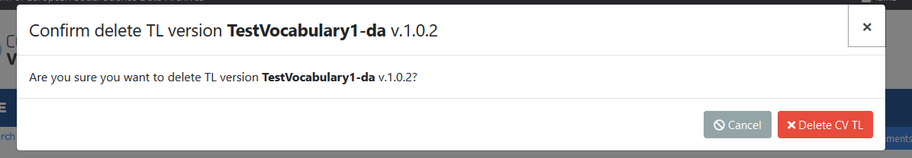 "Image 26")

You can edit CV level information, that is, the translated CV name, CV
definition, translating agency information and vocabulary notes
through the 'Edit TL'. **Make only one change at a time**, since now
you need to add a change type in the pop-up and you can only choose
one change type at a time. It is worthwhile to do changing in this
manner, as this will allow the system to produce an accurate draft
version history for you in the publish pop-up, so you do not need to
keep manual notes to yourself of changes made. Change information is
needed for

versioning and for letting users know what has changed. CV Notes can
be edited at any time even without creating a new version.

The reasons for change presented in the drop-down list for CV-level
information:

● CV name changed

● CV definition amended with meaning change

● CV definition rephrased

● Translation agency and/or link edited.

If you accidentally make more than one change at a time, introduce one
change type and make a careful manual note to yourself of the other
changes made. You will need to add them manually in the publishing
pop-up later.

For editing the codes, click on the code you want to change, then
choose the 'Edit code' button to enter your changes.

This time, before you can save you will need to give the reason for
the change. There are three choices, depending on what you have
changed:

● Code descriptive term rephrased

● Code definition amended with meaning change

● Code definition rephrased

Note: 'Code removed' and 'Code added' are automatically added by the
system to version changes information.

Further information on the meaning of these is on the DDI Alliance
website under the versioning policy:
[http://www.ddialliance.org/controlled-vocabularies]{.ul}

Again, you will need to go from draft status to review before
publishing the next version of the translation.

You can drop this TL version of the CV when the status is DRAFT or
REVIEW, by clicking on 'Delete TL ' button. Choose 'Delete TL CV' in
the pop-up if you want to drop the version.

 "Image 27")

**Please note that this action does not change the status of the CV to
the previous status (e.g. from REVIEW to DRAFT) but drops this
particular version of the TL and returns to the previous published TL
version.** You will lose all information entered for the new version.

The system in general does not allow returning to the previous status.

When you are satisfied with your edited translation, click on the
'Publish TL' button. A publishing pop-up appears where you can enter
information about the changes between this version and the previous
one. If you have done one change at a time and have chosen the correct
change type, the system already has a draft for you in the pop-up in
Version changes field.

 "Image 28")

Check that the 'Version changes' field includes correct information
and all changes made. It is good to verify this by opening the
comparison table in the pop-up. The table shows all changes between
the current and previous version. If the code where the changes have
occurred (e.g. if descriptive term has changed) is missing, add the
code and change type to the Version changes field manually.

 "Image 29")

If a code value or descriptive term has been changed, users benefit
from more detailed information in Version changes than what has been
produced by the system. There it is best to first state the change
type and then say that \[x\] has been changed to \[y\].

[Advice on how to present changes in TL version history]{.ul}

If a code has been deleted:

Code deleted: Health.HealthBehaviour deleted

\- This is probably produced by the system into the Version changes in
the required format or can be copied from the SL version information.
Code value should be used. It is enough to say that a code has been
deleted, no need to inform that the descriptive term has been deleted
as well.

If a code has been added:

Code added: Health.DietAndNutrition

\- This is probably produced by the system into the Version changes in
the required format or can be copied from the SL version information.
Code value should be used. No need to say that the descriptive term
has been added as well.

If a code value has been changed:

Code value changed: Health.Public changed into Health.PublicHealth

\- Easiest to copy the information from SL version history. For
machine actionable updates of metadata, it is best to record both the
old and the new code.

If a code definition has been amended or rephrased:

Code definition rephrased: Health.PhysicalFitnessAndExercise

OR

Code definition amended with meaning change: Physical fitness and
exercise - Code definition changes may be language specific, so you
should enter only when these have changed in your own language. You
may also have changed the definition in TL when there were no changes
in the SL. You can use the code value or descriptive term.

If a descriptive term has been changed:

Descriptive term changed: From x to y

\- These are language specific, so you should enter only when these
have changed in your own language. Use the old descriptive term in
your language for x and the new one for y. It is best to record both,
makes it easier to introduce automated updates to metadata.

You also need to consider whether to add general information to
'Version notes' to explain the changes you have made since the
previous version.For example, that you added definition translations
in this version, or some other notes.

Check that the version number is correct. For translations, each new
version is incremented by .1 - see section 6 for examples. The system
normally suggests a correct number.

The information in version changes and version notes will appear in
the 'Versions'' tab in the user interface and be visible to all. This
will help organisations using the vocabularies to update their
metadata as well as update any vocabularies implemented in their
systems. Version information

is editable after publication in the Editor for the latest version,
without the translator having to create a new version of the TL
vocabulary to amend the information.

## 4 Identity and general

This tab contains the Canonical Uniform Resource Identifier (URI) of
the version. This is produced automatically by the system at
publication for both SL and TL, based on the Canonical URI information
entered into the Agency profile and other information relating to the
CV. The URI cannot be seen in the DRAFT or REVIEW states before the
vocabulary is published for the first time.

The system requires the agency to have a Uniform Resource Name (URN).
If your agency does not have a URN, the CESSDA CV URN
(urn:ddi:int.cessda.cv:) can be used for 'Canonical URI'.

Check after publication that the URI has appeared and is correct. If
they are not, contact the CVS Content Contact. Do not edit them here.

In TL, you can also add or edit the translating agency and a link to
it in this tab \[forthcoming\]. This does not affect versioning.

## 5 Usage tab

This section of the tool shows how the CV is being used.

The usage information can be added using the 'Edit' button on the
right-hand side of the Usage tab. This opens a rich-text box to enable
you to add links, tables etc.

**Usage for DDI (and CESSDA) vocabularies.**

CVs that are used within DDI have details of how they are used within
various versions of DDI. The DDI Alliance can provide details of
usage.

For example mode of collection has the following usage information:

DDI 3.2

Module name: datacollection

Element name: [TypeOfModeOfCollection]{.ul}

DDI 2.5

Element number: 2.3.1.6

Element/attribute name: [collMode]{.ul}

You can create a hyperlink by overshadowing the text to be linked and
by clicking on the 'link' icon

 "Image 30")

For translations of DDI and CESSDA vocabularies, it is best to copy
the Usage information from the SL version. Editing or translating the
copied Usage information text is discouraged, at least for DDI
vocabularies. This is because in future, the CV tool may enable
translations to inherit the SL Usage information and its updates
automatically. Any translations of it would therefore disappear, but
the advantage is that translators would not need to update Usage
information manually.

If you amend the usage information in the SL, it is best to copy this
amended information to the TLs as well, at least for CESSDA and DDI
vocabularies, or inform the CVS Content Contact.

## 6 Licence and citation tab

The copyright statement and the citation are automatically produced by
the system at publication stage for SL and TL. Please check after
publication that the citation is present and correct, you cannot see
it before publication. If not, contact the CVS Content Contact.

Source language license: the licence for each SL vocabulary is chosen
from a drop-down list when publishing the vocabulary for the first
time. Only the licences entered into the system are allowed and in the
list.

Licences available in the CESSDA Vocabulary Service are entered by the
CVS Content Contact. SL administrators can add a default licence for
the agency in the Agency profile. If the licence you need is not in
the system, contact the Content Contact to have it added.

Licence information is mandatory and the system prevents publication
if it is not entered for the CV.

DDI and CESSDA vocabularies have the same licence in both source and
target vocabularies (Creative Commons Attribution 4.0 International),
so when entering a translation for the first time, take care to select
the same license as SL. Currently, the system offers this by default.

## 7 Lifecycle of a CV within the CESSDA Vocabulary Service

This is a simplified version of the lifecycle for creation and
publication of a CV.

● Admin_SL creates a draft version of a CV in the source language.

● Admin_SL starts a review of the CV. Other persons with relevant
roles can now contribute, update, add to the CV.

● Admin_SL finalises review. When satisfied the CV is correct,
Admin_SL publishes the CV. ● The CV is now visible to everyone and
translation of the CV into various languages can be started.
Translators translate the codes and add the license.

● Each translation can be published independently of other languages.

● Once a CV has been published, work on previous SL versions or
translations of previous versions is halted. From this point, no-one
can edit the previous SL version or translations of it. Translators
add their translation of this new SL version but the system will
automatically clone their previous translation as the draft to start
from.

● A new version of translation can be done even if the SL has not
changed, to correct mistakes etc.

## 8 Versioning

If a published CV needs amendments, SL Administrator makes the changes
and publishes the new SL version. Changes can be major (substantive)
or minor (non-substantive). A major change could be adding or deleting
a code, or making changes to the code value. Minor changes are, for
example, changing the text in a definition without altering the
meaning. A full list of changes, both major and minor, are available
on the DDI Alliance website. CESSDA vocabularies have the same
versioning policy.

[http://www.ddialliance.org/controlled-vocabularies]{.ul} (open-out
Versioning Policy).

For the source CV the version is made of two parts, 'n' and 'm', e.g.
2.3. The first part of the version number (n) shows major changes and
the second (m) minor changes.

When publishing a CV version, the next minor version will be
suggested. This can be edited to be a major version change if
required. All changes within a CV should be checked to see whether the
change should be major or minor.

Translated CVs are always based on a version of the source CV. For
example, the first German translation of the English CV version 3.4
will have the version 3.4.1. - an extra digit is added to the end of
the SL version.

For translated CVs there is no difference between major and minor
changes in the versioning value - the next version of a translated CV
is created by adding one to the previous value. So, following the
previous example, the next version of the German CV will be 3.4.2.

When the source CV version number changes, the translated version will
start again from 1.

Further details on versioning can be found at:

[https://docs.google.com/document/d/11O5p_COvzSja3SZgL3hp6awAbs1gaGr5NNBuo7KLFdE/edi]{.ul}
[t?usp=sharing]{.ul}

## 9 Contacts and feedback

If you have any comments on DDI vocabularies, please send an email to
a DDI CVG group member:

[https://ddi-alliance.atlassian.net/wiki/display/DDI4/Controlled+Vocabularies+Working+Group]{.ul}.

If you have comments on CESSDA vocabularies or on the CESSDA
Vocabulary Service, contact the CVS Content Contact Taina Jääskeläinen

[taina DLOT jaaskelainen AT tuni DOT fi]{.ul}
